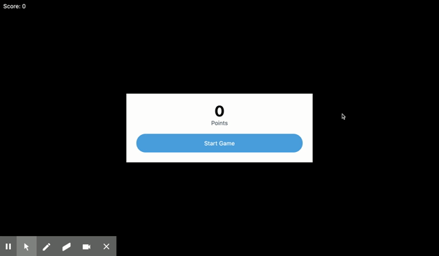

# Canvas Circle Game

[Deployment](https://anusontarangkul.github.io/circle-shoot-game/)

## Description

This is a fun game where you shoot the enemy circles with a projectile missle.

## Installation

No installation necessary.

## Usage

You simplicy click on when you want to shoot the missle. Once you hit an enemy circle, you either destroy them or they shrink. Your score will also increase. Your goal is to get the highest score before an enemy touches you, which ends the game.

## Credits

David Anusontarangkul
[LinkedIn](https://www.linkedin.com/in/anusontarangkul/)
[Github](https://github.com/anusontarangkul)

[Tutorial](https://www.youtube.com/watch?v=eI9idPTT0c4&t=53s) from Chris Courses was used to help complethis this project.

## License

Copyright <2020> <David Anusontarangkul>

Permission is hereby granted, free of charge, to any person obtaining a copy of this software and associated documentation files (the "Software"), to deal in the Software without restriction, including without limitation the rights to use, copy, modify, merge, publish, distribute, sublicense, and/or sell copies of the Software, and to permit persons to whom the Software is furnished to do so, subject to the following conditions:

The above copyright notice and this permission notice shall be included in all copies or substantial portions of the Software.

THE SOFTWARE IS PROVIDED "AS IS", WITHOUT WARRANTY OF ANY KIND, EXPRESS OR IMPLIED, INCLUDING BUT NOT LIMITED TO THE WARRANTIES OF MERCHANTABILITY, FITNESS FOR A PARTICULAR PURPOSE AND NONINFRINGEMENT. IN NO EVENT SHALL THE AUTHORS OR COPYRIGHT HOLDERS BE LIABLE FOR ANY CLAIM, DAMAGES OR OTHER LIABILITY, WHETHER IN AN ACTION OF CONTRACT, TORT OR OTHERWISE, ARISING FROM, OUT OF OR IN CONNECTION WITH THE SOFTWARE OR THE USE OR OTHER DEALINGS IN THE SOFTWARE.
